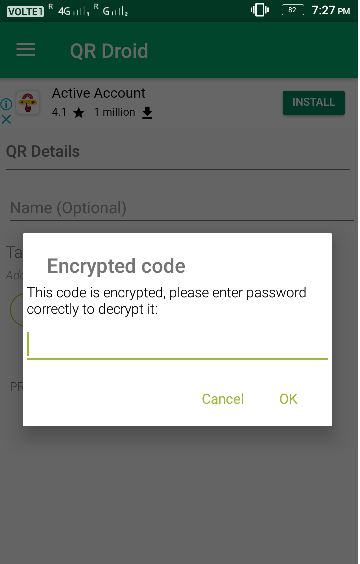
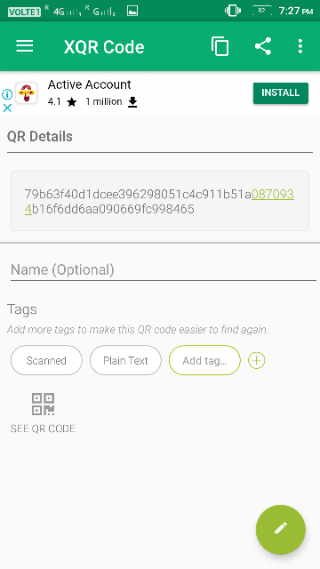

# CoalCrypts

Idea includes mathematical approach and randomized generating functions for enhancing the security from adulterations .It will prevent any unauthorized activity on coal. The ministry of coal will be acting as the black box. The rakes will never know which sample agencies their sample has reached and sample agencies will don’t know which rakes is the owner of the sample .It will include the concept of anonymity .The concept of keys will be use for enhancing the security of ministry and only ministry have full control over the encryption and decryption of coal rakes and sampling agencies. The concept of double blinding is satisfied with the help of digital signatures and there is the system of confidentiality between several stages of coal sampling. The basic algorithms we are using are SHA256, AES algorithm and have generated an algorithm for double blinding.

Basic Algorithm : 

STEP1: Details of the coal organistaion must be encrypted using AES256 algorithm and we get  a password and an encrypted key. 

STEP2: Further, a hash function will be generated using algorithm SHA256 which can be decrypted. 

STEP-3: Store the hash function , password and encrypted key of organisation respectively in a database. 

STEP-4: Build a password protected QR code for the hash function and that password is only known to to ministery.

STEP-5: Place this QRCODE on the sample and pass it to the sample agencies as the password will not be decrypted by anyone.

STEP-6: When the samples are sent back to the ministry from sample agencies the QRCODE can be decrypted by the ministery , and get the hash function.

STEP-7: Check the hash function in the database and get its respective password and encrypted key.

STEP-8: Using that password and encrypted key get back the details of the organisation.

Application used for building and scanning QRCode : QR Droid Zapper

  
    

